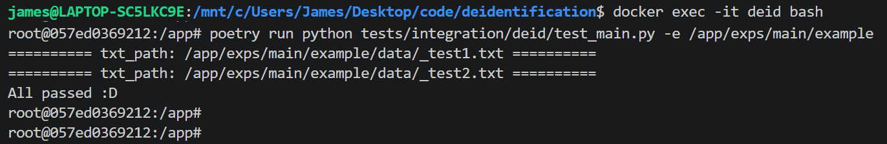

# Introduction
Do

1. deidentification
2. non-identification verification

before calling cloud API


# Evaluation

1. In `exps/main/` prepare a folder structure.<br>
Here use example as an example

    ```txt
    example/
        |_ cfg.yaml     (local llm service inherit `deid/llm_api.py/LLMAPI`)
        |_ prompts/
        |   |_ deid.txt (output pure text)
        |   |_ eval.txt (output dict with "has_pii" key)
        |_ data/*.txt   (data to be deidentified)
    ```

2. run script
    ```bash
    docker exec -it deid bash
    poetry run python tests/integration/deid/test_main.py \
        -e /app/exps/main/example
    ```

    


# Usage

The above evaluation endorse custom "local LLM + prompts + data" are truely deidentified. <br>
Make sure the evaluation is passed before use cloud API !!!

1. At `cfgs/serve.yaml/main_cfg_list`, set your key and cfg_path. 

2. Check examples in `tests/integration/test_serve.py`
    + test_cloud_api_deid -> sync + pure text output 
    + test_cloud_api_pydantic_deid -> sync + dict output
    + test_async_cloud_api_deid -> async + text output
    + test_async_cloud_api_pydantic_deid -> async + dict output


# Detail

Review each components from low to high, <br>
each can be customized by inheritance or parallel expansion.

1. local llm: deid.llm_api.VLLMChat
    + call 
    + pydantic response by hint (preprocess) and jsonify (postprocess)

2. deid prompts, cache, long context: deid.deid_collections.ExampleDeid
    + setting vLLM
    + deid prompt -> eval prompt
    + LRU cache
    + Long context: splitter and divide-and-conquer 

3. deid.main.DeidPipeline
    + deidentification
    + non-identification verification

4. serve.py
    + sync cloud api (normal / pydantic)
    + async cloud api (normal / pydantic)
